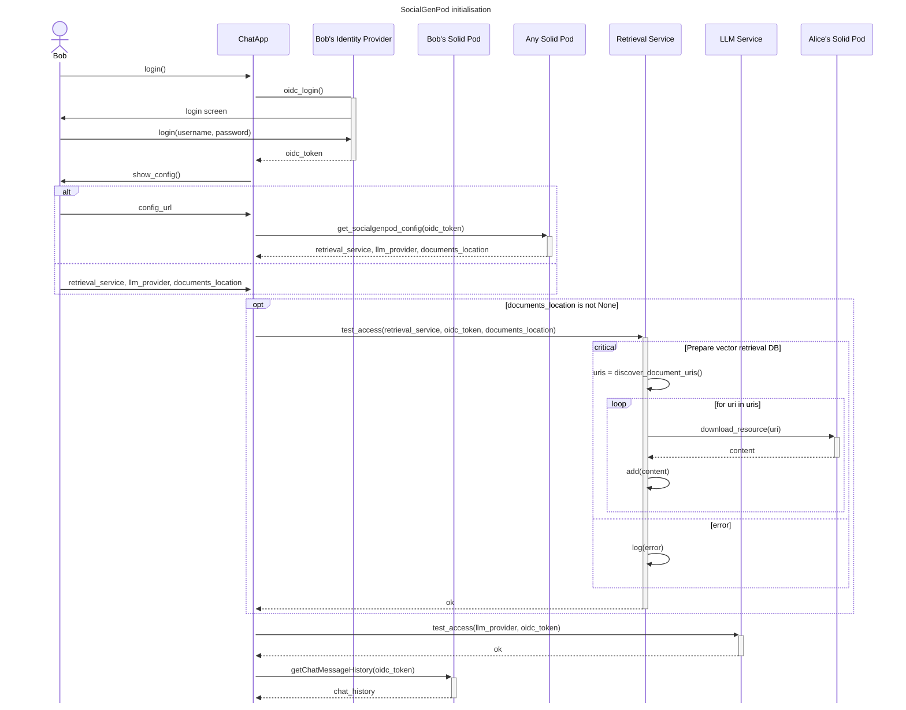
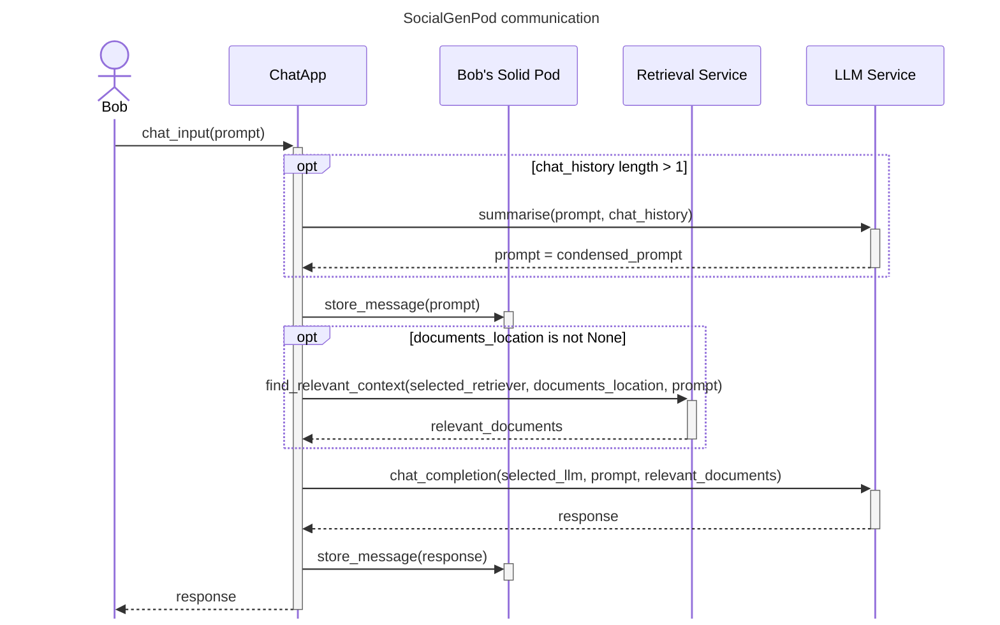

# Social Gen Pod 🐢

Converse with an LLM provider of your choice. Store your documents and chat history in a Solid pod.

This project builds on the work from [ChatDocs-Streamlit](https://github.com/Vidminas/chatdocs-streamlit).

## Setup

Based on <https://stackoverflow.com/questions/76722680/what-is-the-best-way-to-combine-conda-with-standard-python-packaging-tools-e-g>

### Installation with pip

```bash
# local installation of the package:
pip install .

# editable install:
pip install -e .

# editable install with optional dependencies:
pip install -e .[llm]
```

### Installation with conda

When creating an environment from scratch:

```bash
conda create -n ENVNAME "python>=3.11" --file requirements.txt
```

If adding to an established environment, use update:

```bash
conda update --name ENVNAME --file requirements.txt
```

For optional dependencies:

```bash
conda update --name ENVNAME --freeze-installed --file requirements-llm.txt
```

Then install this package using:

```bash
pip install --no-build-isolation --no-deps .
```

## Configuration

### Configuring the retrieval service provider

If running locally, navigate into the `llm_service` directory and copy the provided `.env.sample` file to a `.env` file. Then fill in the values with desired details for a retrieval service provider.

If deploying remotely, instead of using the `.env` file, configure your cloud provider setup to include the environment variables from `.env.sample`.

Caveat: due to non-standartisation of client credentials authentication, the retrieval service provider must be registered with a Community Solid Server (Node Solid Servers like <https://solidcommunity.net> and Enterprise Solid Servers are currently not supported). This only applies to the retrieval service provider, the chat app users can use any Solid server as their identity provider.


### Granting access to documents to the retrieval service provider

For Node Solid Servers, you can use: <https://solidos.github.io/mashlib/dist/browse.html> (see <https://github.com/SolidOS/userguide#manage-your-trusted-applications> for guidance).

For both Community Solid Servers and Node Solid Servers, you can also use: <https://penny.vincenttunru.com/>. Point Penny to browse the pod in which the files you would like to share are stored. Then login as the pod owner. Browse to the resource you would like to share and, under the "Linked Resources" section, press "Add Access Control List". This will create a new `.acl` file with all permissions granted to the pod owner and nothing else. Create a "new thing" in the ACL file, choose "Convert to Access Control" and grant only the "Read" permission to the webid of the retrieval service provider, e.g. `https://solidpod.azurewebsites.net/socialgenpod/profile/card#me`.

### Configuring the LLM provider

If you would like to add different language models or change the configuration, create a file called `genpod.yml` in your working directory before running `genpod-llm`. This will be merged with the configuration in `llm_service/data/genpod.yml` -- see that file for example syntax.

For example, add `download: True` in your configuration to enable downloading models specified in the configuration file -- otherwise only already locally stored models will be possible to use.

For other configuration, such as adding GPU acceleration, see <https://github.com/Vidminas/chatdocs-streamlit>. The configuration file works the same way.

### Making the retrieval service provider or LLM provider available to others

You can deploy the providers on a cloud hosting service or run them locally. When running locally, you could use network tunneling as a quick way to make them available for other people (e.g., using [ngrok](https://ngrok.com/), [serveo](https://serveo.net/), or [localtunnel](https://github.com/localtunnel/localtunnel)).


## Usage

Open chat interface by running `genpod-chat`.

Run the LLM service provider using `genpod-llm`.

### Using the chat app

On opening the chat app, log in with Solid. You will be prompted to configure the chatbot service by providing endpoints of the Retrieval Service Provider and LLM Provider. These may or may not be hosted at the same URL. Optionally, you can add in the path to resources that should be included in retrieval. The app will check whether it can establish a connection to both providers and, if a document location is provided, whether the Retrieval Service Provider is able to access it.


## How it works

See our demo paper (available on arXiv: [SocialGenPod: Privacy-Friendly Generative AI Social Web Applications with Decentralised Personal Data Stores](https://arxiv.org/abs/2403.10408)) for the motivation and overview.

This is an example, simplified flow of network requests when a user, Bob, uses the chat app (assuming the service providers and access permissions have already been configured). It details the example use case described in the demo paper.





## Acknowledgments

`chat_app/data/turtle.png` is from <https://emojipedia.org/mozilla/firefox-os-2.5/turtle>.

## Citing this work

If this work is relevant to your research or if you use it in your work, please consider citing

```
@inproceedings{socialgenpod2024,
  title = {{{SocialGenPod}}: {{Privacy-Friendly Generative AI Social Web Applications}} with {{Decentralised Personal Data Stores}}},
  booktitle = {Companion {{Proceedings}} of the {{ACM Web Conference}} 2024},
  author = {{Vidminas Vizgirda} and {Rui Zhao} and {Naman Goel}},
  publisher = {{ACM}},
  address = {{Singapore}},
  doi = {10.1145/3589335.3651251},
  isbn = {979-8-4007-0172-6/24/05}
}
```